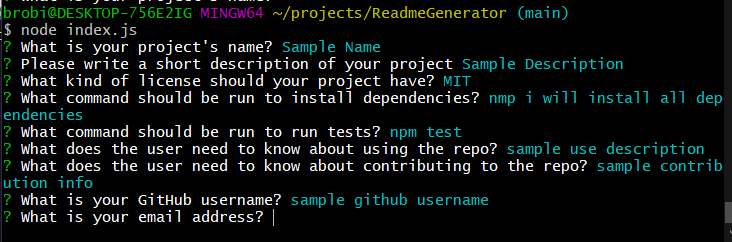

Professional Readme Generator

This is a command-line application that takes in a criteria of questions and uses the answers to generate a professional readme for your project, so that you can spend more time working! Typing "node index.js" in the command line will run the application.

Below, there is a screenshot and a walkthrough video showing how this works.

